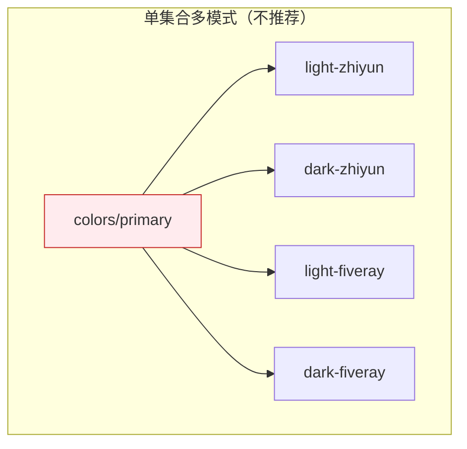

import { Callout } from 'nextra/components'
import { FileTree } from 'nextra/components'

# 多模式系统

多模式系统是 Variables Xporter 的核心特性之一。通过独特的单一出口原则和智能的变量追溯机制，它能够优雅地处理复杂的多模式场景，如明暗主题、品牌主题、响应式设计等。

## 变量追溯机制

Variables Xporter 在处理变量引用时，会自动追溯到最终的具体值。这意味着：

1. 变量可以跨集合引用
2. 引用链可以有多个层级
3. 最终会追溯到一个具体的值

### 引用链示例

让我们看一个实际的引用链示例，以 `colors/primary/DEFAULT` 为例：

```plaintext
                ┌────────────────────────┬────────────────────────┐                    
                │                        │                        │                    
                │ Design Tokens          │         defalut        │                    
                │                        │                        │                    
                ├────────────────────────┼────────────────────────┤                    
                │                        │                        │                    
                │ colors/primary/DEFAULT │ colors/primary/DEFAULT │ ──────┐            
                │                        │                        │       │            
┌──────────────►│ colors/zhiyun/600      │ #E55517                │       │            
│               │                        │                        │       │            
├──────────────►│ colors/zhiyun/500      │ #C03939                │       │            
│               │                        │                        │       │            
├──────────────►│ colors/fiveray/600     │ #EE6D21                │       │            
│               │                        │                        │       │            
├──────────────►│ colors/fiveray/500     │ #DA5959                │       │            
│               │                        │                        │       │            
│               │ ...                    │ ...                    │       │            
│               │                        │                        │       │            
│               └────────────────────────┴────────────────────────┘       │            
│                                                                         │            
│                                                                         │            
│   ┌─────────────────────────────────────────────────────────────────────┘            
│   │                                                                                  
│   │                                                                                  
│   │           ┌────────────────────────┬──────────────────────┬─────────────────────┐
│   │           │                        │                      │                     │
│   │           │ Theme Modes            │         light        │         dark        │
│   │           │                        │                      │                     │
│   │           ├────────────────────────┼──────────────────────┼─────────────────────┤
│   │           │                        │                      │                     │
│   └──────────►│ colors/primary/DEFAULT │ colors/primary/light │ colors/primary/dark │
│               │                        │                      │                     │
│               │ ...                    │ ...      │           │ ...       │         │
│               │                        │          │           │           │         │
│               └────────────────────────┴──────────┼───────────┴───────────┼─────────┘
│                                                   │                       │          
│                                                   │                       │          
│   ┌───────────────────────────────────────────────┴───────────────────────┘          
│   │                                                                                  
│   │                                                                                  
│   │           ┌────────────────────────┬──────────────────────┬─────────────────────┐
│   │           │                        │                      │                     │
│   │           │ Brands Modes           │        zhiyun        │        fiveray      │
│   │           │                        │                      │                     │
│   │           ├────────────────────────┼──────────────────────┼─────────────────────┤
│   │           │                        │                      │                     │
│   ├──────────►│ colors/primary/light   │ colors/zhiyun/600──┐ │ colors/fiveray/600─┐│
│   │           │                        │                    │ │                    ││
│   └──────────►│ colors/primary/dark    │ colors/zhiyun/600──┤ │ colors/fiveray/50──┤│
│               │                        │                    │ │                    ││
│               │ ...                    │ ...                │ │ ...                ││
│               │                        │                    │ │                    ││
│               └────────────────────────┴────────────────────┼─┴────────────────────┼┘
│                                                             │                      │ 
│                                                             │                      │ 
└─────────────────────────────────────────────────────────────┴──────────────────────┘ 
```

在这个结构中：

1. **Design Tokens（主集合）作为唯一出口**
   - `colors/primary/DEFAULT` 引用了 Theme Modes 集合中的同名变量
   - 储存了基础的色板

2. **Theme Modes 管理明暗主题下的变量**
   - `colors/primary/DEFAULT` 有两个模式：
     - light mode → 引用 Brand Modes 集合的 `colors/primary/light`
     - dark mode → 引用 Brand Modes 集合的 `colors/primary/dark`

3. **Brand Modes 管理不同品牌模式下的变量**
   - 在 zhiyun mode 下：
     - `colors/primary/light` 引用 Design Tokens 集合的 `colors/zhiyun/500`（`#E55517`）
     - `colors/primary/dark` 引用 Design Tokens 集合的 `colors/zhiyun/600`（`#EE6D21`）
   - 在 fiveray mode 下：
     - `colors/primary/light` 引用 Design Tokens 集合的 `colors/fiveray/500`（`#C03939`）
     - `colors/primary/dark` 引用 Design Tokens 集合的 `colors/fiveray/600`（`#DA5959`）

<Callout type="info" emoji="💡">
使用时，设计师只需要在 Design Tokens 集合中选择 `colors/primary/DEFAULT`。插件会根据当前激活的模式组合自动追溯到正确的颜色值。例如：
- light + zhiyun → `#E55517`
- light + fiveray → `#C03939`
- dark + zhiyun → `#EE6D21`
- dark + fiveray → `#DA5959`
</Callout>

## 单一出口原则

单一出口原则的核心思想是：

1. 所有变量的访问都通过主集合（Design Tokens）进行
2. 每个集合注于管理己维度的模式变化
3. 通过变量引用，将不同维度的模式变化串联起来

### 传统方法的问题

传统的做法通常是在一个集合中设置多个模式：



这种方法的问题在于：
1. 模式组合呈指数增长（light/dark × zhiyun/fiveray = 4个模式）
2. 所有变量都被迫设置所有模式组合
3. 难以管理和维护，特别是在添加新的品牌或模式时

### 单一出口原则的优势

相比之下，单一出口原则来以下好处：

1. **模式解耦**
   - Theme Modes 集合只关注明暗主题切换
   - Brand Modes 集合只关注品牌差异
   - 每个维度独立管理，互不干扰

2. **按需设置**
   - 只为需要变化的变量设置不同模式
   - 基础颜色值保存在主集合中
   - 更符合实际设计需求

3. **易于维护**
   - 清晰的变量引用关系
   - 容易添加新的品牌或主题
   - 方便进行局部修改

4. **使用简单**
   - 设计师只需要在主集合中选择变量
   - 无需关心复杂的模式组合
   - 导出时只需选择主集合

<Callout type="warning" emoji="⚠️">
虽然变量可以跨集合引用，但建议保持引用链的长度适中，过长的引用链可能会影响可维护性。
</Callout>

## 最佳实践

1. **集合组织**
   - 设置一个主集合作为单一出口
   - 为每个变化维度（如主题、品牌）创建独立的集合
   - 在主集合中存储基础变量值

2. **变量引用**
   - 在主集合中创建统一的变量入口
   - 根据模式类型组织引用链
   - 确保引用关系清晰可追踪

3. **模式管理**
   - 按照变化维度划分模式
   - 只为需要变化的变量设置模式
   - 及时清理未使用的模式和变量

## 下一步

了解了多模式系统的原理后，你可以：

- 学习如何[组织颜色系统](/docs/organizing-your-variables/colors)
- 了解[导出模式](/docs/export-modes)的细节
- 查看[高级功能](/docs/advanced-features)的使用方法

### 集合与变量

让我们看看每个集合中的变量和它们的值：

#### Design Tokens 集合

| 变量名 | default mode |
|--------|--------------|
| colors/primary/DEFAULT | colors/primary/DEFAULT |
| colors/zhiyun/600 | #EE6D21 |
| colors/fiveray/600 | #DA5959 |
| colors/zhiyun/500 | #E55517 |
| colors/fiveray/500 | #C03939 |

#### Theme Modes 集合

| 变量名 | light mode | dark mode |
|--------|------------|-----------|
| colors/primary/DEFAULT | colors/primary/light | colors/primary/dark |

#### Brand Modes 集合

| 变量名 | zhiyun mode | fiveray mode |
|--------|-------------|--------------|
| colors/primary/light | colors/zhiyun/500 | colors/fiveray/500 |
| colors/primary/dark | colors/zhiyun/600 | colors/fiveray/600 |

<Callout type="info" emoji="💡">
在这个结构中，每个集合都专注于管理自己维度的变量变化：
- Design Tokens 存储实际的颜色值和主入口变量
- Theme Modes 管理明暗主题的切换
- Brand Modes 管理不同品牌的颜色变体
</Callout>